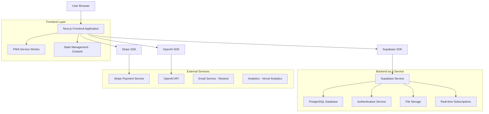
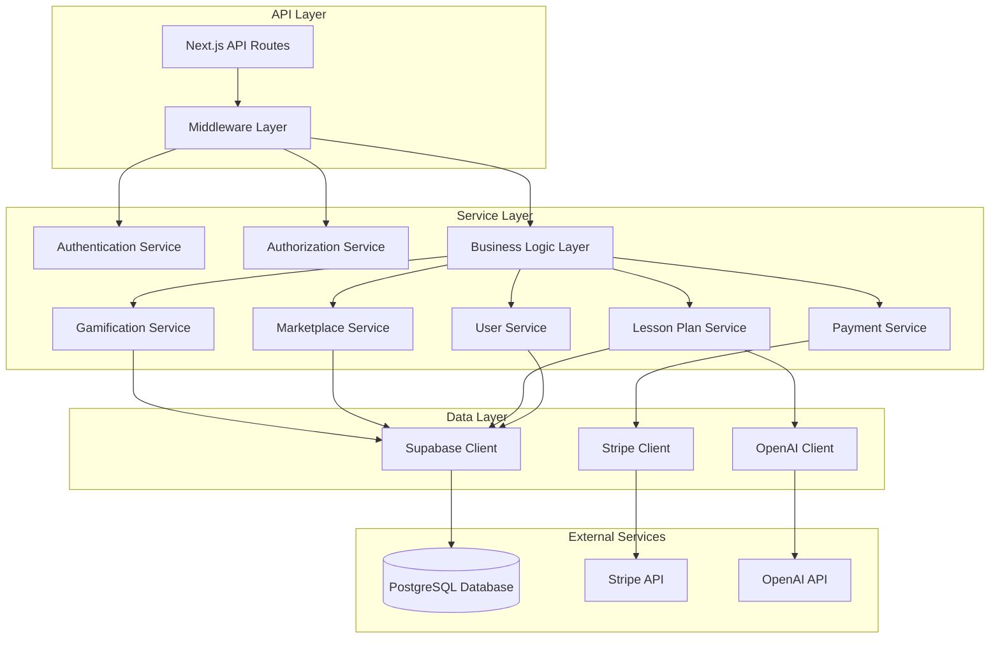

# Arquitetura Técnica - Aula Completa SaaS
## Plataforma Educacional para Professores Autônomos

## 1. Architecture design



## 2. Technology Description

- **Frontend**: Next.js 14 + TypeScript + Tailwind CSS + Radix UI
- **Backend**: Supabase (PostgreSQL + Auth + Storage + Real-time)
- **State Management**: Zustand + React Query
- **Payments**: Stripe + PIX integration
- **AI**: OpenAI GPT-4 API
- **Email**: Resend
- **Deploy**: Vercel
- **Mobile**: PWA (Progressive Web App)

## 3. Route definitions

| Route | Purpose |
|-------|---------|
| / | Landing page com hero, preços, depoimentos e CTA |
| /login | Página de autenticação unificada (login/cadastro) |
| /onboarding | Fluxo de boas-vindas para novos usuários |
| /dashboard | Dashboard principal com métricas e acesso rápido |
| /generator | Interface do gerador de planos de aula com IA |
| /marketplace | Catálogo de planos de aula para compra/venda |
| /marketplace/sell | Interface para professores venderem seus planos |
| /marketplace/[id] | Página detalhada de um plano específico |
| /gamification | Sistema de ranking, badges e desafios |
| /community | Fóruns e grupos de discussão |
| /community/[group] | Página específica de um grupo |
| /profile | Configurações de conta e perfil do usuário |
| /subscription | Gerenciamento de assinatura e pagamentos |
| /admin | Dashboard administrativo (super_admin apenas) |

## 4. API definitions

### 4.1 Core API

**Autenticação de usuários**
```
POST /api/auth/login
```

Request:
| Param Name| Param Type  | isRequired  | Description |
|-----------|-------------|-------------|-------------|
| email     | string      | true        | Email do usuário |
| password  | string      | true        | Senha do usuário |

Response:
| Param Name| Param Type  | Description |
|-----------|-------------|-------------|
| user      | User        | Dados do usuário autenticado |
| session   | Session     | Token de sessão |

**Geração de plano de aula com IA**
```
POST /api/generate-lesson-plan
```

Request:
| Param Name| Param Type  | isRequired  | Description |
|-----------|-------------|-------------|-------------|
| subject   | string      | true        | Disciplina (Matemática, Português, etc.) |
| grade     | string      | true        | Série/ano letivo |
| topic     | string      | true        | Tema da aula |
| duration  | number      | true        | Duração em minutos |
| objectives| string[]    | false       | Objetivos específicos da BNCC |

Response:
| Param Name| Param Type  | Description |
|-----------|-------------|-------------|
| lessonPlan| LessonPlan  | Plano de aula gerado |
| tokens    | number      | Tokens utilizados |

**Marketplace - Listar planos**
```
GET /api/marketplace/plans
```

Query Parameters:
| Param Name| Param Type  | isRequired  | Description |
|-----------|-------------|-------------|-------------|
| subject   | string      | false       | Filtro por disciplina |
| grade     | string      | false       | Filtro por série |
| page      | number      | false       | Página (default: 1) |
| limit     | number      | false       | Itens por página (default: 12) |

**Sistema de pagamentos**
```
POST /api/payments/create-subscription
```

Request:
| Param Name| Param Type  | isRequired  | Description |
|-----------|-------------|-------------|-------------|
| planId    | string      | true        | ID do plano (monthly/annual) |
| paymentMethod| string   | true        | Método (card/pix) |

### 4.2 Tipos TypeScript Compartilhados

```typescript
interface User {
  id: string;
  email: string;
  name: string;
  role: 'professor' | 'super_admin';
  subscription: 'free' | 'premium_monthly' | 'premium_annual';
  credits: number;
  points: number;
  created_at: string;
}

interface LessonPlan {
  id: string;
  title: string;
  subject: string;
  grade: string;
  duration: number;
  objectives: string[];
  content: {
    introduction: string;
    development: string;
    conclusion: string;
    activities: Activity[];
    resources: string[];
    evaluation: string;
  };
  author_id: string;
  price?: number;
  is_public: boolean;
  created_at: string;
}

interface Activity {
  title: string;
  description: string;
  duration: number;
  type: 'individual' | 'group' | 'presentation';
}

interface MarketplaceItem {
  id: string;
  lesson_plan: LessonPlan;
  price: number;
  rating: number;
  reviews_count: number;
  sales_count: number;
  preview_content: string;
}

interface GameProfile {
  user_id: string;
  points: number;
  level: number;
  badges: Badge[];
  achievements: Achievement[];
  monthly_rank: number;
  total_plans_created: number;
  total_sales: number;
}

interface Badge {
  id: string;
  name: string;
  description: string;
  icon: string;
  rarity: 'common' | 'rare' | 'epic' | 'legendary';
  earned_at: string;
}
```

## 5. Server architecture diagram



## 6. Data model

### 6.1 Data model definition

```mermaid
erDiagram
    USERS ||--o{ LESSON_PLANS : creates
    USERS ||--o{ MARKETPLACE_ITEMS : sells
    USERS ||--o{ PURCHASES : makes
    USERS ||--|| GAME_PROFILES : has
    USERS ||--o{ COMMUNITY_POSTS : writes
    
    LESSON_PLANS ||--o{ MARKETPLACE_ITEMS : listed_as
    LESSON_PLANS ||--o{ REVIEWS : receives
    
    MARKETPLACE_ITEMS ||--o{ PURCHASES : purchased_as
    MARKETPLACE_ITEMS ||--o{ REVIEWS : has
    
    GAME_PROFILES ||--o{ USER_BADGES : earns
    BADGES ||--o{ USER_BADGES : awarded_to
    
    COMMUNITY_GROUPS ||--o{ COMMUNITY_POSTS : contains
    USERS ||--o{ GROUP_MEMBERSHIPS : joins
    COMMUNITY_GROUPS ||--o{ GROUP_MEMBERSHIPS : has

    USERS {
        uuid id PK
        string email UK
        string name
        string role
        string subscription_type
        integer credits
        integer points
        timestamp created_at
        timestamp updated_at
    }
    
    LESSON_PLANS {
        uuid id PK
        uuid author_id FK
        string title
        string subject
        string grade
        integer duration
        jsonb content
        jsonb objectives
        boolean is_public
        timestamp created_at
    }
    
    MARKETPLACE_ITEMS {
        uuid id PK
        uuid lesson_plan_id FK
        uuid seller_id FK
        decimal price
        decimal rating
        integer reviews_count
        integer sales_count
        text preview_content
        boolean is_active
        timestamp created_at
    }
    
    PURCHASES {
        uuid id PK
        uuid buyer_id FK
        uuid marketplace_item_id FK
        decimal amount
        string payment_method
        string status
        timestamp created_at
    }
    
    GAME_PROFILES {
        uuid user_id PK FK
        integer points
        integer level
        integer monthly_rank
        integer total_plans_created
        integer total_sales
        timestamp updated_at
    }
    
    BADGES {
        uuid id PK
        string name
        string description
        string icon
        string rarity
        jsonb requirements
    }
    
    USER_BADGES {
        uuid id PK
        uuid user_id FK
        uuid badge_id FK
        timestamp earned_at
    }
    
    COMMUNITY_GROUPS {
        uuid id PK
        string name
        string description
        string subject
        uuid creator_id FK
        integer member_count
        timestamp created_at
    }
    
    COMMUNITY_POSTS {
        uuid id PK
        uuid author_id FK
        uuid group_id FK
        string title
        text content
        integer likes_count
        timestamp created_at
    }
    
    GROUP_MEMBERSHIPS {
        uuid id PK
        uuid user_id FK
        uuid group_id FK
        string role
        timestamp joined_at
    }
    
    REVIEWS {
        uuid id PK
        uuid reviewer_id FK
        uuid marketplace_item_id FK
        integer rating
        text comment
        timestamp created_at
    }
```

### 6.2 Data Definition Language

**Tabela de Usuários (users)**
```sql
-- Criar tabela de usuários
CREATE TABLE users (
    id UUID PRIMARY KEY DEFAULT gen_random_uuid(),
    email VARCHAR(255) UNIQUE NOT NULL,
    name VARCHAR(100) NOT NULL,
    role VARCHAR(20) DEFAULT 'professor' CHECK (role IN ('professor', 'super_admin')),
    subscription_type VARCHAR(20) DEFAULT 'free' CHECK (subscription_type IN ('free', 'premium_monthly', 'premium_annual')),
    credits INTEGER DEFAULT 5,
    points INTEGER DEFAULT 0,
    avatar_url TEXT,
    bio TEXT,
    created_at TIMESTAMP WITH TIME ZONE DEFAULT NOW(),
    updated_at TIMESTAMP WITH TIME ZONE DEFAULT NOW()
);

-- Políticas RLS
ALTER TABLE users ENABLE ROW LEVEL SECURITY;
GRANT SELECT ON users TO anon;
GRANT ALL PRIVILEGES ON users TO authenticated;

CREATE POLICY "Users can view own profile" ON users
    FOR SELECT USING (auth.uid() = id);
CREATE POLICY "Users can update own profile" ON users
    FOR UPDATE USING (auth.uid() = id);
```

**Tabela de Planos de Aula (lesson_plans)**
```sql
-- Criar tabela de planos de aula
CREATE TABLE lesson_plans (
    id UUID PRIMARY KEY DEFAULT gen_random_uuid(),
    author_id UUID REFERENCES users(id) ON DELETE CASCADE,
    title VARCHAR(200) NOT NULL,
    subject VARCHAR(50) NOT NULL,
    grade VARCHAR(20) NOT NULL,
    duration INTEGER NOT NULL,
    content JSONB NOT NULL,
    objectives JSONB DEFAULT '[]',
    is_public BOOLEAN DEFAULT false,
    created_at TIMESTAMP WITH TIME ZONE DEFAULT NOW(),
    updated_at TIMESTAMP WITH TIME ZONE DEFAULT NOW()
);

-- Índices para performance
CREATE INDEX idx_lesson_plans_author ON lesson_plans(author_id);
CREATE INDEX idx_lesson_plans_subject ON lesson_plans(subject);
CREATE INDEX idx_lesson_plans_grade ON lesson_plans(grade);
CREATE INDEX idx_lesson_plans_public ON lesson_plans(is_public) WHERE is_public = true;

-- Políticas RLS
ALTER TABLE lesson_plans ENABLE ROW LEVEL SECURITY;
GRANT SELECT ON lesson_plans TO anon;
GRANT ALL PRIVILEGES ON lesson_plans TO authenticated;

CREATE POLICY "Authors can manage own plans" ON lesson_plans
    FOR ALL USING (auth.uid() = author_id);
CREATE POLICY "Public plans are viewable" ON lesson_plans
    FOR SELECT USING (is_public = true);
```

**Tabela do Marketplace (marketplace_items)**
```sql
-- Criar tabela do marketplace
CREATE TABLE marketplace_items (
    id UUID PRIMARY KEY DEFAULT gen_random_uuid(),
    lesson_plan_id UUID REFERENCES lesson_plans(id) ON DELETE CASCADE,
    seller_id UUID REFERENCES users(id) ON DELETE CASCADE,
    price DECIMAL(10,2) NOT NULL CHECK (price >= 0),
    rating DECIMAL(3,2) DEFAULT 0 CHECK (rating >= 0 AND rating <= 5),
    reviews_count INTEGER DEFAULT 0,
    sales_count INTEGER DEFAULT 0,
    preview_content TEXT,
    is_active BOOLEAN DEFAULT true,
    created_at TIMESTAMP WITH TIME ZONE DEFAULT NOW()
);

-- Índices
CREATE INDEX idx_marketplace_seller ON marketplace_items(seller_id);
CREATE INDEX idx_marketplace_rating ON marketplace_items(rating DESC);
CREATE INDEX idx_marketplace_price ON marketplace_items(price);
CREATE INDEX idx_marketplace_active ON marketplace_items(is_active) WHERE is_active = true;

-- Políticas RLS
ALTER TABLE marketplace_items ENABLE ROW LEVEL SECURITY;
GRANT SELECT ON marketplace_items TO anon;
GRANT ALL PRIVILEGES ON marketplace_items TO authenticated;
```

**Tabela de Gamificação (game_profiles)**
```sql
-- Criar tabela de perfis de gamificação
CREATE TABLE game_profiles (
    user_id UUID PRIMARY KEY REFERENCES users(id) ON DELETE CASCADE,
    points INTEGER DEFAULT 0,
    level INTEGER DEFAULT 1,
    monthly_rank INTEGER DEFAULT 0,
    total_plans_created INTEGER DEFAULT 0,
    total_sales INTEGER DEFAULT 0,
    updated_at TIMESTAMP WITH TIME ZONE DEFAULT NOW()
);

-- Função para calcular nível baseado em pontos
CREATE OR REPLACE FUNCTION calculate_level(points INTEGER)
RETURNS INTEGER AS $$
BEGIN
    RETURN FLOOR(points / 100) + 1;
END;
$$ LANGUAGE plpgsql;

-- Trigger para atualizar nível automaticamente
CREATE OR REPLACE FUNCTION update_user_level()
RETURNS TRIGGER AS $$
BEGIN
    NEW.level = calculate_level(NEW.points);
    NEW.updated_at = NOW();
    RETURN NEW;
END;
$$ LANGUAGE plpgsql;

CREATE TRIGGER trigger_update_level
    BEFORE UPDATE ON game_profiles
    FOR EACH ROW
    EXECUTE FUNCTION update_user_level();

-- Políticas RLS
ALTER TABLE game_profiles ENABLE ROW LEVEL SECURITY;
GRANT SELECT ON game_profiles TO anon;
GRANT ALL PRIVILEGES ON game_profiles TO authenticated;
```

**Dados Iniciais**
```sql
-- Inserir badges padrão
INSERT INTO badges (name, description, icon, rarity, requirements) VALUES
('Primeiro Plano', 'Criou seu primeiro plano de aula', '🎯', 'common', '{"plans_created": 1}'),
('Criador Ativo', 'Criou 10 planos de aula', '📚', 'common', '{"plans_created": 10}'),
('Especialista', 'Criou 50 planos de aula', '🏆', 'rare', '{"plans_created": 50}'),
('Vendedor Iniciante', 'Primeira venda no marketplace', '💰', 'common', '{"sales_count": 1}'),
('Empreendedor', 'R$ 100 em vendas', '🚀', 'rare', '{"total_revenue": 100}'),
('Mentor', 'Ajudou 10 colegas na comunidade', '🤝', 'epic', '{"community_helps": 10}');

-- Inserir templates BNCC básicos
INSERT INTO lesson_plans (author_id, title, subject, grade, duration, content, is_public) VALUES
(
    (SELECT id FROM users WHERE role = 'super_admin' LIMIT 1),
    'Template - Matemática Fundamental',
    'Matemática',
    '6º Ano',
    50,
    '{"introduction": "Introdução aos conceitos básicos", "development": "Desenvolvimento da aula", "conclusion": "Conclusão e fixação", "activities": [], "resources": ["Quadro", "Giz"], "evaluation": "Avaliação formativa"}',
    true
);
```

## 7. Configurações de Deploy e Ambiente

### 7.1 Variáveis de Ambiente
```env
# Supabase
NEXT_PUBLIC_SUPABASE_URL=your_supabase_url
NEXT_PUBLIC_SUPABASE_ANON_KEY=your_supabase_anon_key
SUPABASE_SERVICE_ROLE_KEY=your_service_role_key

# OpenAI
OPENAI_API_KEY=your_openai_api_key

# Stripe
NEXT_PUBLIC_STRIPE_PUBLISHABLE_KEY=your_stripe_publishable_key
STRIPE_SECRET_KEY=your_stripe_secret_key
STRIPE_WEBHOOK_SECRET=your_webhook_secret

# Email
RESEND_API_KEY=your_resend_api_key

# App
NEXT_PUBLIC_APP_URL=https://aulacompletasaas.com
```

### 7.2 Configurações de Produção
- **CDN**: Vercel Edge Network para assets estáticos
- **Database**: Supabase com backup automático diário
- **Monitoring**: Vercel Analytics + Sentry para error tracking
- **Security**: Rate limiting, CORS configurado, headers de segurança
- **Performance**: Image optimization, code splitting automático

Esta arquitetura garante escalabilidade, segurança e performance para o Aula Completa SaaS, suportando milhares de professores simultâneos com baixa latência.