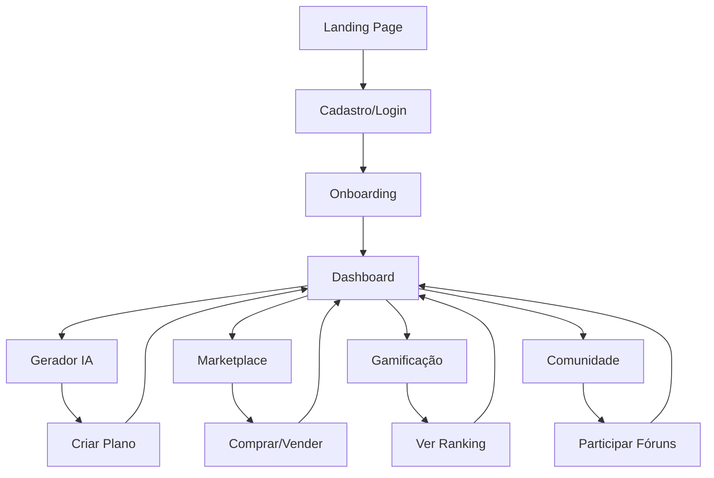

# PRD - Aula Completa SaaS
## Plataforma Educacional para Professores Autônomos Brasileiros

## 1. Product Overview

O **Aula Completa** é uma plataforma SaaS educacional que capacita professores autônomos brasileiros a criar, gerenciar e monetizar planos de aula de alta qualidade usando inteligência artificial. A plataforma oferece ferramentas integradas de criação, marketplace educacional e sistema de gamificação para transformar a experiência pedagógica.

O produto resolve três problemas principais: a dificuldade de criar planos de aula alinhados à BNCC, a falta de uma plataforma para monetizar conhecimento pedagógico, e a ausência de reconhecimento profissional para educadores autônomos. Com foco no mercado educacional brasileiro, a plataforma visa gerar receita recorrente através de assinaturas mensais e anuais, criando um ecossistema sustentável para educadores.

## 2. Core Features

### 2.1 User Roles

| Role | Registration Method | Core Permissions |
|------|---------------------|------------------|
| Professor Free | Email + confirmação | 5 planos IA/mês, templates básicos, visualização marketplace |
| Professor Premium | Upgrade via pagamento | Planos IA ilimitados, marketplace completo, gamificação, comunidade |
| Super Admin | Acesso administrativo | Gestão completa, analytics, configurações, moderação |

### 2.2 Feature Module

Nossa plataforma SaaS consiste nas seguintes páginas principais:

1. **Landing Page**: hero section com proposta de valor, demonstração da IA, depoimentos de professores, planos de preços, call-to-action para cadastro.

2. **Página de Autenticação**: login/cadastro unificado, recuperação de senha, integração com Google, onboarding para novos usuários.

3. **Dashboard Principal**: métricas pessoais, planos criados recentemente, estatísticas de vendas, sistema de pontuação, acesso rápido às funcionalidades.

4. **Gerador de Planos com IA**: interface de criação assistida, templates BNCC, personalização por série/disciplina, exportação em múltiplos formatos.

5. **Marketplace**: catálogo de planos de aula, sistema de compra/venda, avaliações e comentários, filtros por disciplina/série.

6. **Página de Gamificação**: ranking de usuários, badges conquistados, desafios mensais, histórico de conquistas.

7. **Comunidade**: fóruns de discussão, grupos por disciplina, compartilhamento de experiências, suporte entre pares.

8. **Configurações de Conta**: gerenciamento de assinatura, dados pessoais, preferências de notificação, histórico de pagamentos.

### 2.3 Page Details

| Page Name | Module Name | Feature description |
|-----------|-------------|---------------------|
| Landing Page | Hero Section | Apresentar proposta de valor com vídeo demonstrativo da IA, estatísticas de impacto, botão CTA principal |
| Landing Page | Planos de Preços | Exibir três planos (Free, Premium Mensal R$ 29,90, Premium Anual R$ 299,90) com comparativo de recursos |
| Landing Page | Depoimentos | Carousel com depoimentos reais de professores, fotos e resultados obtidos |
| Autenticação | Login/Cadastro | Formulário unificado com tabs, validação em tempo real, integração Google OAuth |
| Autenticação | Onboarding | Fluxo de boas-vindas com 3 etapas: perfil, preferências, primeiro plano |
| Dashboard | Métricas Pessoais | Cards com planos criados, vendas realizadas, pontuação atual, meta mensal |
| Dashboard | Acesso Rápido | Botões para criar plano, acessar marketplace, ver ranking, configurações |
| Gerador IA | Interface de Criação | Formulário estruturado com disciplina, série, tema, objetivos BNCC, duração |
| Gerador IA | Templates BNCC | Biblioteca de templates pré-configurados por disciplina e ano letivo |
| Gerador IA | Exportação | Download em PDF, Word, Google Docs, compartilhamento direto |
| Marketplace | Catálogo | Grid de planos com preview, preço, avaliações, filtros avançados |
| Marketplace | Compra/Venda | Sistema de pagamento integrado, upload de planos, definição de preços |
| Marketplace | Avaliações | Sistema de 5 estrelas, comentários, histórico de compras |
| Gamificação | Ranking | Leaderboard mensal/anual, categorias por disciplina, sistema de pontos |
| Gamificação | Badges | Conquistas visuais por marcos (criador, vendedor, mentor, especialista) |
| Gamificação | Desafios | Metas semanais/mensais com recompensas, progresso visual |
| Comunidade | Fóruns | Discussões por tópicos, moderação automática, sistema de curtidas |
| Comunidade | Grupos | Criação de grupos por disciplina/região, chat em tempo real |
| Configurações | Assinatura | Upgrade/downgrade de planos, histórico de pagamentos, cancelamento |
| Configurações | Perfil | Dados pessoais, foto, bio profissional, preferências de notificação |

## 3. Core Process

### Fluxo do Professor (Usuário Principal)

O professor acessa a landing page, se cadastra gratuitamente e passa pelo onboarding de 3 etapas. No dashboard, ele pode criar até 5 planos mensais usando a IA, visualizar o marketplace e acompanhar suas métricas básicas. Para funcionalidades avançadas, ele faz upgrade para Premium, desbloqueando criação ilimitada, acesso completo ao marketplace para vender seus planos, sistema de gamificação com pontos e badges, e participação na comunidade.

### Fluxo do Super Admin

O super admin acessa um dashboard administrativo com visão completa da plataforma: métricas de usuários, receita, conteúdo mais popular, moderação de conteúdo do marketplace e comunidade. Ele pode gerenciar usuários, configurar parâmetros da IA, definir desafios de gamificação e acompanhar KPIs de negócio em tempo real.

## 4. User Interface Design

### 4.1 Design Style

**Cores Primárias**: Azul educacional (#4F46E5), branco (#FFFFFF), cinza claro (#F8FAFC)
**Cores Secundárias**: Verde sucesso (#10B981), laranja destaque (#F59E0B), vermelho alerta (#EF4444)

**Botões**: Estilo sólido com bordas arredondadas (8px), hover com elevação sutil, gradientes sutis para CTAs principais

**Tipografia**: Inter como fonte principal (16px base), títulos em 24-32px, hierarquia clara com pesos 400, 500, 600

**Layout**: Design limpo e minimalista, cards com sombras sutis, espaçamento generoso (16px, 24px, 32px), grid responsivo

**Ícones**: Lucide React com estilo outline, tamanho 20-24px, cores consistentes com a paleta

### 4.2 Page Design Overview

| Page Name | Module Name | UI Elements |
|-----------|-------------|-------------|
| Landing Page | Hero Section | Background gradiente sutil, título grande (48px), subtítulo (20px), botão CTA azul proeminente, vídeo demo centralizado |
| Landing Page | Planos | Cards brancos com sombra, destaque visual para plano Premium, badges "Mais Popular", preços em destaque |
| Dashboard | Métricas | Cards com ícones coloridos, números grandes (32px), gráficos simples, cores de status (verde/laranja/azul) |
| Gerador IA | Formulário | Layout em duas colunas, campos com labels claras, preview em tempo real, botão "Gerar" em destaque |
| Marketplace | Catálogo | Grid responsivo 3-4 colunas, cards com imagem, título, preço, estrelas, hover com elevação |
| Gamificação | Ranking | Tabela estilizada, avatares circulares, badges coloridos, barras de progresso, animações sutis |

### 4.3 Responsiveness

A plataforma é **mobile-first** com breakpoints em 768px (tablet) e 1024px (desktop). Navegação mobile com menu hambúrguer, cards empilhados verticalmente, botões com área de toque mínima de 44px. Otimização para touch com gestos de swipe no marketplace e formulários adaptados para teclados móveis.

## 5. Modelo de Negócio e Precificação

### 5.1 Planos de Assinatura

**Plano Free (R$ 0/mês)**
- 5 planos de aula com IA por mês
- Templates básicos da BNCC
- Visualização do marketplace
- Suporte por email

**Plano Premium Mensal (R$ 29,90/mês)**
- Planos de aula ilimitados com IA
- Todos os templates premium
- Venda no marketplace (taxa 10%)
- Sistema de gamificação completo
- Acesso à comunidade
- Suporte prioritário

**Plano Premium Anual (R$ 299,90/ano - 2 meses grátis)**
- Todos os recursos do Premium Mensal
- Taxa reduzida no marketplace (5%)
- Recursos exclusivos antecipados
- Consultoria pedagógica mensal
- Badge "Professor Expert"

### 5.2 Fontes de Receita Adicionais

- **Marketplace**: Taxa de 5-10% sobre vendas entre professores
- **Cursos Premium**: Workshops e masterclasses pagas
- **Consultoria**: Serviços personalizados para escolas
- **API**: Licenciamento da IA para outras plataformas educacionais

## 6. Roadmap de Desenvolvimento

### Fase 1 - MVP (3 meses)
- Landing page profissional
- Sistema de autenticação completo
- Dashboard básico
- Gerador de IA aprimorado
- Sistema de pagamentos (Stripe + PIX)

### Fase 2 - Crescimento (3 meses)
- Marketplace completo
- Sistema de gamificação
- Dashboard avançado com analytics
- App mobile (PWA)

### Fase 3 - Comunidade (2 meses)
- Fóruns e grupos
- Sistema de mentoria
- Integrações com Google Classroom
- API pública

## 7. Métricas de Sucesso

### KPIs Principais
- **MRR (Monthly Recurring Revenue)**: Meta R$ 50.000/mês no primeiro ano
- **Churn Rate**: Manter abaixo de 5% mensal
- **CAC (Customer Acquisition Cost)**: Máximo R$ 60 por usuário
- **LTV (Lifetime Value)**: Mínimo R$ 600 por usuário Premium

### Métricas de Engajamento
- **DAU/MAU**: 40% de usuários ativos diários
- **Planos Criados**: Média 15 planos/usuário Premium/mês
- **Marketplace**: 20% dos usuários Premium vendendo ativamente
- **NPS**: Manter acima de 70 pontos

## 8. Considerações Técnicas e Compliance

### LGPD e Privacidade
- Consentimento explícito para coleta de dados
- Direito ao esquecimento implementado
- Criptografia de dados sensíveis
- Auditoria de acesso aos dados

### Segurança
- Autenticação multifator opcional
- Rate limiting nas APIs
- Backup automático diário
- Monitoramento de segurança 24/7

### Performance
- Core Web Vitals otimizados
- CDN para assets estáticos
- Cache inteligente
- Otimização para conexões lentas (3G)

Este PRD serve como documento base para o desenvolvimento do Aula Completa SaaS, priorizando a experiência do professor autônomo brasileiro e criando um ecossistema sustentável de educação digital.